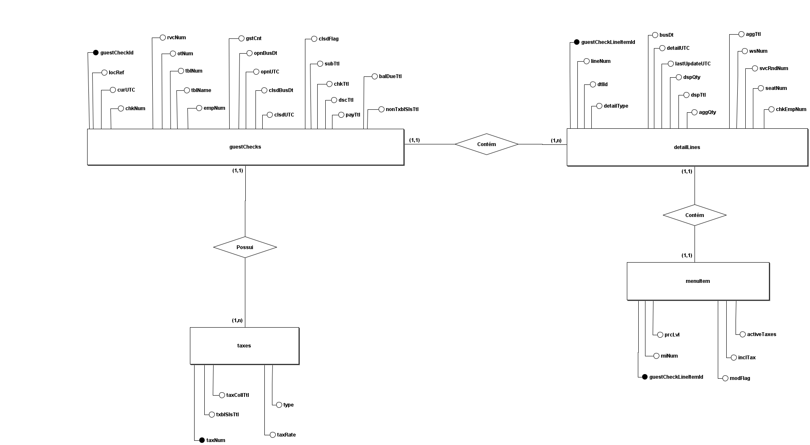

# Desafio Engenharia de Dados - Coco Bambu 2024

##  Sobre o Projeto

Este repositório contém a solução para o desafio de Engenharia de Dados.

##  Desafios

### Desafio 1 - Modelagem de Dados

Solução completa incluindo:

1. **MER - Modelo Entidade Relacional**

2. **Transcrição para SQL (MySQL)**
   - 4 tabelas relacionais com estrutura completa
   - Suporte a múltiplas lojas (cadeia de restaurantes)

3. **Justificativa da Abordagem**
    - Primeiramente com base no Json, montei um esboço de como poderia ser o relacionamento entre as tabelas presentes (guestChecks,taxes,detailLines e menuItem). Após isso usei a ferramenta brmodelo para fazer o MER. Tive alguma dificuldade para interpretar os nomes dos atributos pois não tinha um dicionario de dados presente na descrição do desafio.

**Principais Tabelas:**
- `guestChecks` - Lojas da cadeia
- `taxes` - Impostos/taxas
- `detailLines` - Informações do pedido
- `menuItem` - Detalhes de itens do menu

### Desafio 2 - Data Lake e Armazenamento

**Arquivo:** `Desafio2.md`

Aborda questões sobre:

1. **Por que armazenar respostas das APIs?**

    - Para manter um histórico e garantir que os dados não se percam caso a API mude ou fique fora do ar. Além disso, armazenar as respostas permite validar informações, refazer análises sem precisar chamar a API novamente e comparar dados entre diferentes dias ou lojas.

2. **Como você armazenaria os dados?**

   - Eu criaria pastas separando os arquivos por data e tipo de API. Assim fica fácil achar e atualizar as informações.

3. **Se guestChecks.taxes for renomeado para guestChecks.taxation, o que isso implicaria?**
   - Isso quebraria os scripts ou pipelines que dependem do nome antigo do campo. Seria necessário atualizar o código que lê o JSON, os mapeamentos para o banco e as transformações no data lake. Também seria importante registrar essa mudança em um controle de versão dos esquemas (schema registry) para evitar erros em processamentos futuros.

